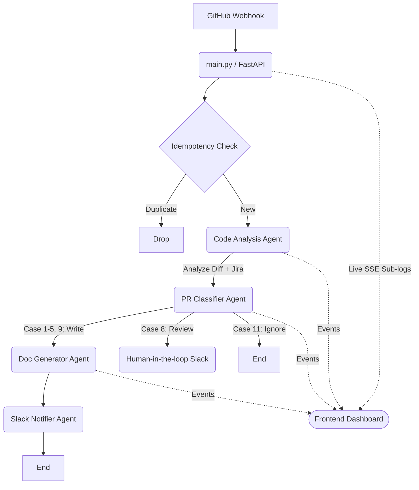

# DocuSync AI Architecture 🏛️

DocuSync is designed as a pipeline of independent, specifically purposed agents. By chaining them together inside a central FastAPI router, we create a system that can accurately react to GitHub events, make deterministic decisions using LLMs, mutate external state (Confluence), and live-stream progress to users.

This document breaks down the core structural design.

---

## 🏗️ High-Level System Flow

## 🧩 Architectural Components

### 1. `main.py` (The Director)
The entry point of the application. It acts as the traffic controller:
- Boots up the **FastAPI** `uvicorn` web server.
- Registers standard API endpoints (e.g., `/webhook/github`).
- Wraps incoming payloads, sets up the thread-local state (`contextvars.ContextVar`) required for the Dashboard, and dispatches the data to the appropriate processing function.
- Enforces payload validation (e.g., ignoring push events that are not PRs, ignoring PRs that aren't closed/merged).

### 2. `integrations/.*` (The Connectors)
Modules designated purely for talking safely to external APIs. They know how to format requests, handle authentication, manage pagination or base64 decoding, but they contain **zero business logic**.
- `github_handler.py` (Fetches raw diffs using PATs).
- `jira_client.py` (Pulls ticket descriptions).
- `confluence_client.py` (Manages CQL searches, XML macro conversions, and Page publish API calls).

### 3. `agents/.*` (The Mind)
The core logic blocks that actually do "work" using Airia AI pipelines.
- **`code_analysis.py`**: A general-purpose comprehension agent. Takes the raw diff and the Jira descriptions, and asks an LLM to output structured JSON depicting "What changed," "How does it impact the architecture," and "How risky is it?"
- **`pr_classifier.py`**: A secondary safety agent. Uses the output from `code_analysis` to sort the GitHub event into one of 13 specific operational "cases" (e.g., Case 4 = Section Update, Case 9 = Deprecation Banner, Case 11 = Minor cleanup, ignore for docs).
- **`doc_generation.py`**: The mutating agent. Driven by the classification case, it decides whether to generate a completely new page, find and replace specific headers using Regex, aggregate API endpoints natively on an "API Reference" page, or inject HTML warning banners.

### 4. `routers/dashboard.py` & `templates/dashboard.html` (The UI Window)
A dedicated, disjoint frontend view providing real-time operational debug views to humans.
- Uses `asyncio.Queue` arrays locally within FastAPI to simulate basic **Server-Sent Events (SSE)**.
- Any agent can call `emit_sub_log()`. As long as the execution runs inside the bounds of the Director's context (`current_pr.get()`), this log is packaged as JSON and instantly shoved down the TCP pipe to any listening browser window.
- The browser natively caches the PR states in a Javascript `Map` and reactively updates DOM elements whenever a new chunk of JSON arrives.

### 5. `agents/staging_store.py` (The State Memory)
A local SQLite file managing deterministic idempotency. 
- Because GitHub webhooks often misfire, time out, or get manually re-delivered by engineers, the server needs to "remember" what it has done. 
- When a `delivery_guid` is received at the HTTP boundary, this store checks for its existence. If it's already recorded, the pipeline is short-circuited entirely, preventing DocuSync from accidentally duplicating text in Confluence or spamming Slack channels. 
